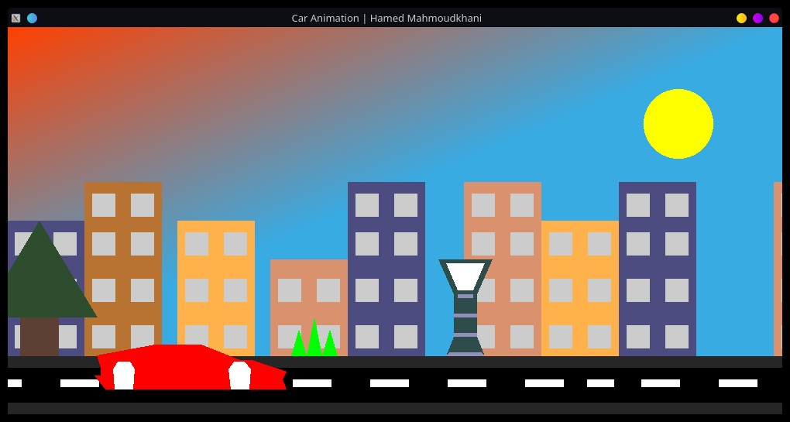
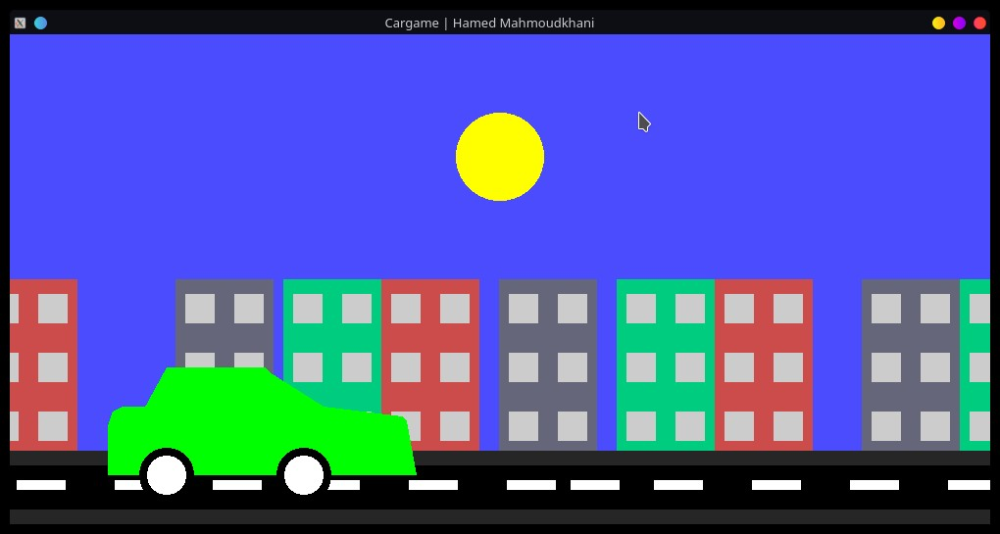

# Simple car game
This is a simple car game build with GLUT
animation have some transisions between day and night but game is simpler and can controlled by right click.

# Compile
1. Install freeglut: `(pacman -S freeglut)` or use apt,dnf,yaourt
2. Compile command: `g++ game.cpp -lglut -lGL -lGLU -o game`
3. Run: `./game`

# Screenshots

